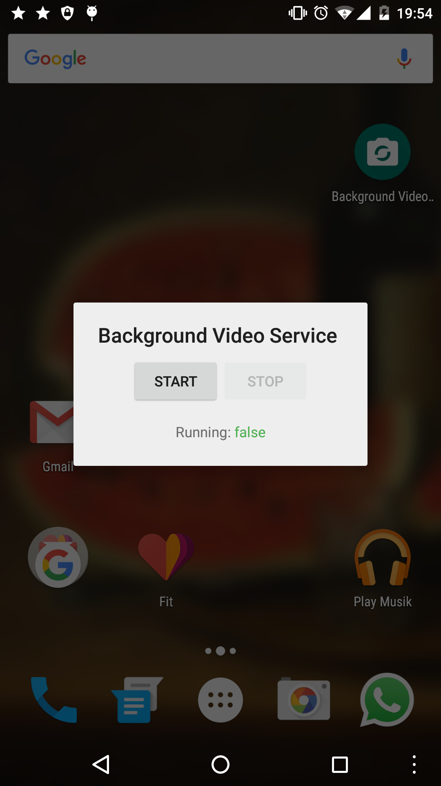
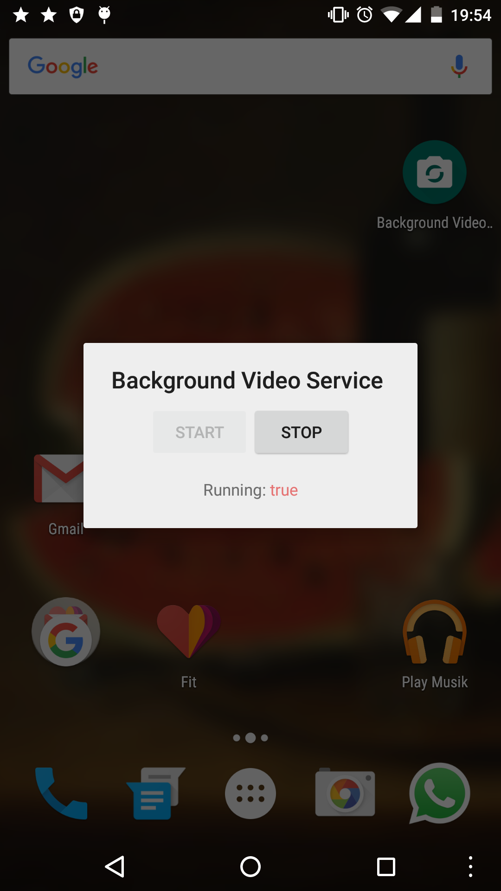

#  Background Video Service

This is a proof-of-concept on how applications are be able to record videos with the back-camera without notice by the user.
The following permissions are necessary to perform recordings:

- android.permission.CAMERA
- android.permission.RECORD_AUDIO
- android.permission.SYSTEM_ALERT_WINDOW
- android.permission.WRITE_EXTERNAL_STORAGE
- android.permission.READ_EXTERNAL_STORAGE

Results are saved in the **Output** folder with the **yyyy-MM-dd_kk-mm-ss** date-pattern as filename.

## Screenshots

&nbsp;

## Build

This project is developed using JetBrain's latest IntelliJ IDEA and the latest Gradle-wrapper.
To compile Background Video Service, simply import this project into **Android Studio or IntelliJ IDEA** and press the build-button.
**You may need to sign the built apk.** Read the official [documentation about signing applications](https://developer.android.com/tools/publishing/app-signing.html) for a how-to.

## License

Copyright 2015 Lukas Wolfsteiner

Licensed under the Apache License, Version 2.0 (the "License");
you may not use this file except in compliance with the License.
You may obtain a copy of the License at

    http://www.apache.org/licenses/LICENSE-2.0

Unless required by applicable law or agreed to in writing, software
distributed under the License is distributed on an "AS IS" BASIS,
WITHOUT WARRANTIES OR CONDITIONS OF ANY KIND, either express or implied.
See the License for the specific language governing permissions and
limitations under the License.